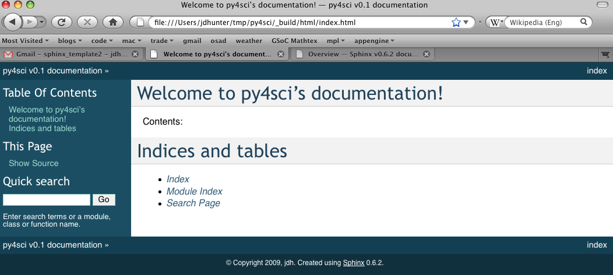

.. _sphinx_helpers:

******************
Sphinx Cheat Sheet
******************

Cheat sheet on how to make this site and install these extensions and
other goodies.  You can see a literal version of this file below in
:ref:`sphinx-literal`.

.. _installing-docdir:
Installing your doc directory
=============================

You may already have sphinx `sphinx <http://sphinx.pocoo.org/>`_
installed -- you can check by doing::

  python -c 'import sphinx'

If that fails grab the latest version of and install it with::

  > sudo easy_install sphinx

Now you are ready to build a template for your docs, using
sphinx-quickstart::

  > sphinx-quickstart

accepting most of the defaults.  I choose "py4sci" as the name of my
project.  cd into your new directory and check the contents::

  home:~/tmp/py4sci> ls
  Makefile	_static		conf.py
  _build		_templates	index.rst

The index.rst is the master ReST for your project, but before adding
anything, let's see if we can build some html::

  make html

If you now point your browser to :file:`_build/html/index.html`, you
should see a basic spinx site.

